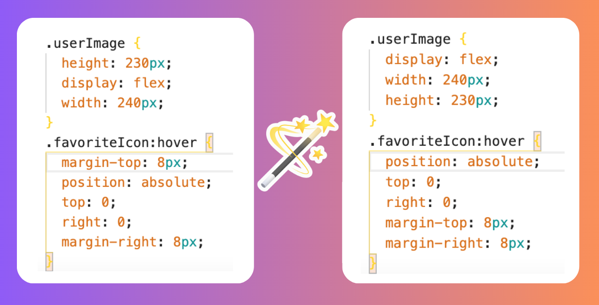

<div align="center">
<h1>CSS Style Sorter</h1>
</div>

Automatically sort CSS properties on save. Use your preferred sort order to keep your stylesheets organized.

## Features

- **Automatic sorting**: CSS properties are sorted upon saving a file.
- **Customizable sort order**: Configure the order properties should be sorted.
- **Flexible categorization**: Properties can be grouped into categories for a more organized structure.
- **Use alongside formatters like prettier.**



## Extension Settings

Custom sort order and categories can be configured in settings.

1. Open settings
   - Click the gear icon in the bottom left corner, or
   - Press `Ctrl+` (Windows/Linux) / `Cmd+` (Mac).
2. Search for "CSS Style Sorter" in the search bar at the top of the settings window.
3. Modify the settings according to your preferences:
   - `css-style-sorter.sortOrder`: Defines the sort order of categories.
   - `css-style-sorter.categories`: Group properties by category.

The default sort order is: `Box Model, Typography, Background and Visual, Grid, Flexbox, Margin and Padding, Border, Width and Height, Transformations and Animations, and Other`

Category example:

``` json
"Box Model": [
    "display",
    "position",
    "top",
    "right",
    "bottom",
    "left",
    "z-index",
    "float",
    "clear",
    "box-sizing"
]
```

<!-- ## Release Notes

### 1.0.0

Initial release
-->
---

Built with TypeScript & [CSSTree](https://github.com/csstree/csstree)

View the source code on [GitHub](https://github.com/dejmedus/css-style-sorter)
